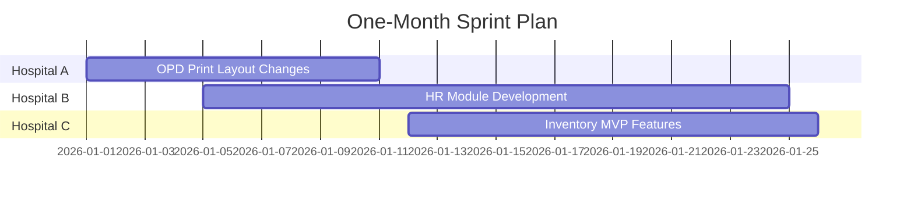
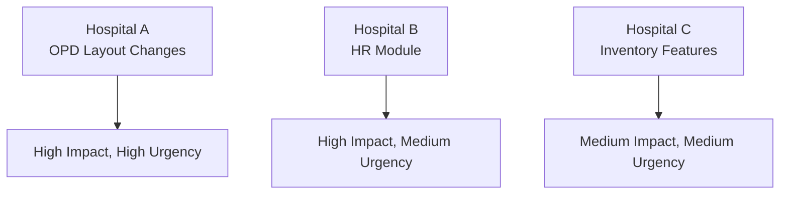

# 📊 Sprint Planning Visuals

## Sprint Timeline (Gantt Chart)

```mermaid
gantt
    title One-Month Sprint Plan
    dateFormat  YYYY-MM-DD

    section Hospital A
    OPD Print Layout Changes :a1, 2026-01-01, 10d

    section Hospital B
    HR Module Development :b1, 2026-01-05, 20d

    section Hospital C
    Inventory MVP Features :c1, 2026-01-12, 14d
```
## Prioritization Matrix (Impact vs Urgency)

```mermaid
flowchart TD
    A[Hospital A<br/>OPD Layout Changes] --> P1[High Impact, High Urgency]
    B[Hospital B<br/>HR Module] --> P2[High Impact, Medium Urgency]
    C[Hospital C<br/>Inventory Features] --> P3[Medium Impact, Medium Urgency]
```

